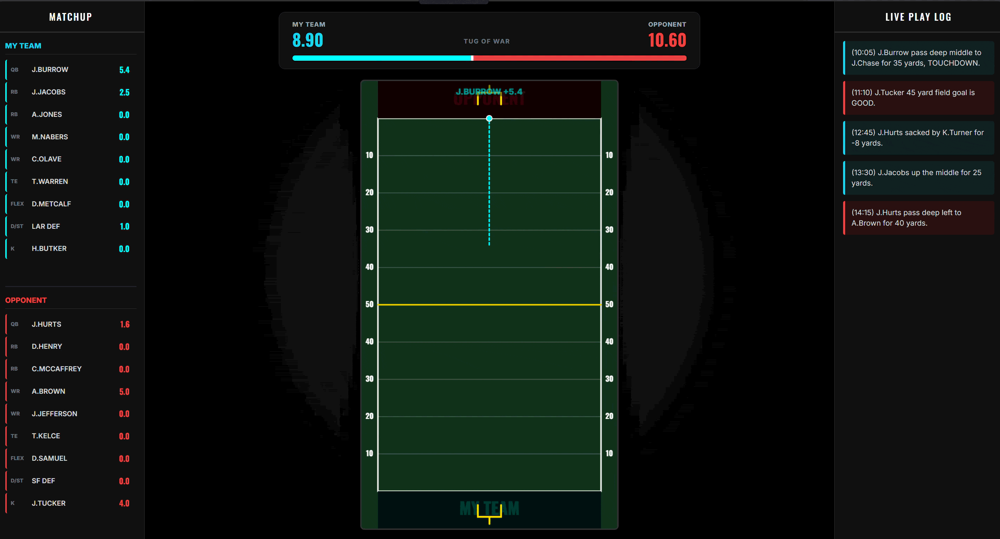

🏈 Fantasy Field Live

Fantasy Field Live is a real-time, animated fantasy football dashboard. Instead of passively refreshing a stat sheet, this application acts as a live broadcast, parsing real-world NFL play-by-play data and animating the action dynamically on an HTML5 canvas in your browser.

✨ Features

Real-Time Play Animation: Watches the live NFL data feed and translates text-based play-by-play logs into coordinate-mapped visual animations on a digital football field.

Intelligent Auto-Rostering: Automatically scrapes your active ESPN Fantasy starting lineup to track your specific matchup.

NLP Play Parsing: Uses custom Regular Expressions (Regex) to extract player names, yardage, and play types (sacks, passes, touchdowns) from raw string data.

Live Tug-of-War UI: Features an interactive tug-of-war scoreboard that reacts instantly to fantasy point changes.

WebSocket Integration: Pushes processed play data from the Python backend to the frontend seamlessly, ensuring the UI animates the exact moment a play concludes in real life.

🛠️ Tech Stack

Backend: Python, FastAPI, HTTPX (for async API requests)

Real-Time Data: WebSockets

Frontend: Vanilla JavaScript, HTML5 Canvas API (for 60fps animations)

Styling: Tailwind CSS

🧠 How it Works

The Scraper: The backend continuously polls the ESPN NFL Scoreboard API for live play strings across all active games.

The Parser: A custom NLP engine scans the strings, identifies key players, normalizes their names (e.g., J.Burrow), and correlates them to your active fantasy roster.

The Broadcast: If a player on your roster (or your opponent's) is involved, the backend calculates the fantasy points earned and pushes a JSON packet through a WebSocket.

The Field: The HTML5 Canvas receives the packet, calculates the scaled X/Y coordinates based on the line of scrimmage, and draws the animation, popups, and score updates.

🚀 Local Setup

Clone the repository: git clone https://github.com/bdalton04/fantasy-field-live.git

Install the required Python packages: pip install fastapi uvicorn httpx python-dotenv

Create a .env file in the root directory and add your ESPN credentials (see .env.example).

Start the server: uvicorn main2:app --reload

Open your web browser and navigate to: http://localhost:8000

⚠️ Offseason & Preseason Behavior

If you run this application outside of the active NFL regular season, the terminal may output an Expecting value: line 1 column 1 (char 0) error when attempting to fetch live matchup data. This is expected behavior.

ESPN's live scoreboard endpoints return empty responses when no official fantasy matchups are active. The backend is built to handle this gracefully: it catches the empty response, prevents a server crash, and automatically loads fallback placeholder data so the frontend UI can still be rendered and tested using the local mock data simulation.

🔒 Note on API Credentials

This project requires an ESPN SWID and espn_s2 cookie to fetch private league data. Never commit these to GitHub. Always use environment variables to keep your data secure!
